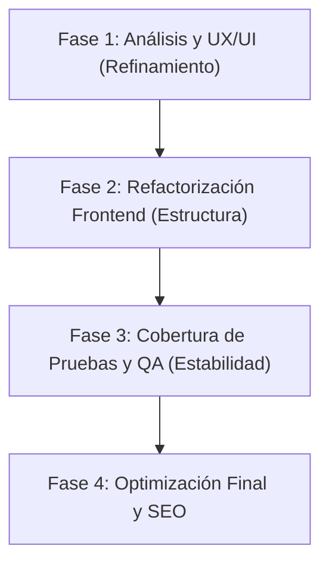

# 📋 Plan de Mejoramiento - WebChilePro

Este plan ha sido diseñado por el **Orquestador Principal** en colaboración con los subagentes especializados recién integrados en el entorno de desarrollo: **Frontend React**, **UX/UI** y **QA (Quality Assurance)**. El objetivo es llevar la plataforma a un nivel de calidad de código óptimo y profesional, optimizar la experiencia de usuario, cumplir con accesibilidad internacional y garantizar un software libre de regresiones.

---

## 🗺️ Mapa de Ruta General (Hitos)

---

## ⚛️ 1. Aportes del Subagente: Frontend React Engineer

El rol de este subagente es la modularización, legibilidad, escalabilidad y buenas prácticas de React 19.

### 🔍 Hallazgos en el Código Actual
* **Lógica concentrada en la vista:** [Presupuesto.jsx](file:///c:/Users/Sebastian/Desktop/Programacion/proyectos/webchilepro/src/pages/Presupuesto.jsx) maneja tanto el renderizado de la UI como el cálculo complejo de servicios, descuentos (10% y 20%) y multiplicadores.
* **Prop Drilling:** El estado `total` y la función `setTotal` se inicializan en [App.jsx](file:///c:/Users/Sebastian/Desktop/Programacion/proyectos/webchilepro/src/App.jsx) y se transmiten a los componentes hijos de forma manual.

### 🛠️ Tareas y Aportes Específicos
* **Extracción de Lógica a Custom Hooks:**
  * Crear un hook personalizado `useCalculoPresupuesto.js` que se encargue exclusivamente del cálculo matemático de servicios, multiplicadores y descuentos para limpiar `Presupuesto.jsx`.
* **Implementación de Context API (Opcional si escala):**
  * Evaluar el uso de un `PresupuestoContext` para evitar pasar `total` y `setTotal` manualmente a través de la jerarquía de componentes, permitiendo un acceso más limpio desde el `NavBar`.
* **Optimización de Renderizado:**
  * Envolver callbacks con `useCallback` y componentes de tarjeta con `React.memo` si las mediciones indican que la selección de un servicio provoca re-renderizados innecesarios en todas las demás tarjetas de la lista.
* **JSDoc y Tipado:**
  * Agregar anotaciones JSDoc con tipado para los parámetros de props a fin de mejorar el autocompletado y depuración en el editor.

---

## 🎨 2. Aportes del Subagente: UX/UI Designer (Figma & CSS)

Este subagente se enfocará en que el sitio web se sienta interactivo, accesible, visualmente impactante y de alta calidad.

### 🔍 Hallazgos en el Diseño Actual
* **Feedback de Selección:** Las tarjetas de servicios son funcionales, pero la selección se puede mejorar visualmente.
* **Feedback sobre el Descuento:** El descuento se muestra directamente como texto en el resultado final, pero carece de un elemento dinámico de "progreso" que incentive al usuario a agregar más servicios para alcanzar un descuento mayor.

### 🛠️ Tareas y Aportes Específicos
* **Gamificación y Barra de Progreso del Descuento:**
  * Diseñar una barra de progreso visual en [ResultadoPresupuesto.jsx](file:///c:/Users/Sebastian/Desktop/Programacion/proyectos/webchilepro/src/components/ResultadoPresupuesto.jsx) que indique de forma dinámica cuánto le falta al usuario para calificar al descuento del 10% ($500.000) o del 20% ($1.000.000).
* **Micro-interacciones y Animaciones:**
  * Añadir sutiles micro-animaciones CSS (escala, cambio suave de fondo con transiciones) en las tarjetas de servicio seleccionadas en [app.css](file:///c:/Users/Sebastian/Desktop/Programacion/proyectos/webchilepro/app.css) para que la UI se sienta viva.
* **Revisión de Accesibilidad (WCAG AA):**
  * Validar los contrastes de colores de los textos en gris claro sobre fondos claros.
  * Añadir soporte completo para navegación por teclado (`tabIndex`, enfoque visible en las tarjetas) y anunciar los cambios de precio a lectores de pantalla utilizando `aria-live`.

---

## 🧪 3. Aportes del Subagente: QA Subagent & Tester

El rol de este subagente es actuar como adversario del software, escribiendo pruebas automatizadas que impidan que futuros cambios rompan la lógica actual del negocio.

### 🔍 Hallazgos en el Testing Actual
* **Baja cobertura:** Existen archivos como [Presupuesto.test.jsx](file:///c:/Users/Sebastian/Desktop/Programacion/proyectos/webchilepro/src/pages/Presupuesto.test.jsx), pero no se cubren escenarios alternativos complejos o la validación del formulario de contacto.

### 🛠️ Tareas y Aportes Específicos
* **Ampliación de Pruebas Unitarias en el Cotizador:**
  * Escribir pruebas unitarias que validen:
    * El cálculo correcto del total según multiplicadores específicos de tipo de proyecto (Landing Page, E-commerce, etc.).
    * La aplicación correcta del descuento del 10% cuando el total supera los $500.000.
    * La aplicación correcta del descuento del 20% cuando el total supera el $1.000.000.
    * Comportamiento en los límites exactos (ejemplo: $499.999 vs $500.000).
* **Pruebas del Formulario de Contacto:**
  * Crear un archivo de prueba para el formulario de contacto (`Contacto.test.jsx`) verificando:
    * Validación de campos obligatorios (nombre, correo, mensaje).
    * Validación de sintaxis de correo electrónico.
    * Envío exitoso simulado (mock de servicio de email).
* **Testing de Flujo de Integración:**
  * Probar el flujo completo del usuario: Selección de Tipo de Proyecto -> Selección de Servicios -> Visualización del Presupuesto final -> Redirección a Contacto con datos persistidos.

---

## 🚀 4. Aportes del Subagente: Performance & SEO Optimizer

Este subagente se encarga de que la aplicación sea altamente indexable por motores de búsqueda, rápida y con excelente rendimiento SEO técnico.

### 🔍 Hallazgos en el SEO Actual
* **Metadatos estáticos:** El archivo [index.html](file:///c:/Users/Sebastian/Desktop/Programacion/proyectos/webchilepro/index.html) tiene un título y descripción estáticos, lo que significa que el buscador indexa la misma descripción para todas las páginas (Home, Tipo, Presupuesto, Contacto) sin reflejar el contenido de la ruta actual.

### 🛠️ Tareas y Aportes Específicos
* **Metadatos Dinámicos con React 19:**
  * Implementar el soporte nativo de React 19 para hoisting de elementos `<title>` y `<meta name="description">` directamente dentro de los componentes de página.
  * Personalizar las descripciones y los títulos para cada una de las rutas:
    * **Home**: `WebChilePro - Cotizador de Proyectos Web | INACAP` (Descripción sobre cotizaciones inteligentes e instantáneas).
    * **Tipo de Proyecto**: `Selecciona tu Tipo de Proyecto | WebChilePro` (Descripción sobre elegir soluciones WordPress o a medida).
    * **Presupuesto**: `Cotiza tus Servicios Adicionales | WebChilePro` (Descripción para configurar adicionales como hosting, SEO, chatbot IA).
    * **Contacto**: `Solicita tu Presupuesto Web | WebChilePro` (Descripción para enviar cotizaciones y coordinar desarrollo).

---

## 📢 Asignación de Responsabilidades y Próximos Pasos

Para llevar a cabo este plan de manera ordenada, se trabajará de la siguiente forma:

1. **UX/UI** definirá los cambios de estilos en [app.css](file:///c:/Users/Sebastian/Desktop/Programacion/proyectos/webchilepro/app.css) y propondrá la estructura de la barra de progreso del descuento en Figma/Diseño.
2. **Frontend React** implementará los hooks y la estructura de componentes limpia.
3. **QA** escribirá las pruebas automatizadas correspondientes para verificar que toda la lógica de cálculo y envío de datos funcione perfectamente bajo cualquier circunstancia.
4. **Performance & SEO** configurará los metadatos de encabezado nativos de React 19 en todas las vistas de ruta del proyecto.

---
*Este documento es de acceso público y debe servir como la guía de desarrollo y calidad para todo el equipo.*
